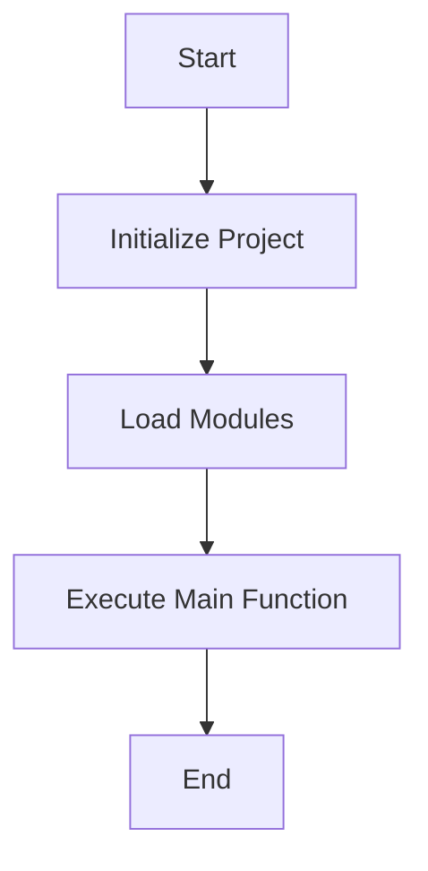

# Kotlin Project

This is a    simple Kotlin project that demonstrates the use of Kotlin data classes and a basic application setup using Gradle as the build tool.

## Project Structure

The project consists of the following files:

- `build.gradle.kts`: The Gradle build script written in Kotlin DSL.
- `src/main/kotlin/Person.kt`: A Kotlin file defining a `Person` data class.
- `src/main/kotlin/Main.kt`: The main Kotlin file containing the entry point of the application.

## Getting Started

### Prerequisites

- **Java Development Kit (JDK)**: Ensure you have JDK 8 or higher installed on your machine.
- **Gradle**: This project uses Gradle, but you don't need to install it manually. The Gradle Wrapper is included in the project.

### Building the Project

To build the project, navigate to the project directory and run the following command:

```bash
./gradlew build
```

This command will compile the Kotlin source files and package them into a JAR file.

### Running the Application

To run the application, use the following command:

```bash
./gradlew run
```

This will execute the `main` function in `Main.kt`, which prints "Hello World!" to the console.

## Project Details

### build.gradle.kts

- **Plugins**: The project uses the Kotlin JVM plugin version 2.0.0.
- **Group and Version**: The project is organized under the group `org.example` with version `1.0-SNAPSHOT`.
- **Repositories**: Dependencies are resolved from Maven Central.
- **Dependencies**: The project includes a dependency for Kotlin test libraries to facilitate testing.
- **Tasks**: The `test` task is configured to use JUnit Platform for running tests.

### Person.kt

This file defines a simple data class `Person` with three properties:

- `name`: A `String` representing the person's name.
- `age`: An `Int` representing the person's age.
- `email`: A `String` representing the person's email address.

### Main.kt

This file contains the `main` function, which serves as the entry point of the application. It simply prints "Hello World!" to the console.

## Testing

The project is set up to use JUnit for testing. You can run the tests using the following command:

```bash
./gradlew test
```

## Contributing

If you wish to contribute to this project, feel free to fork the repository and submit pull requests.

## License

This project is licensed under the MIT License. See the LICENSE file for more details.

## Contact

For any questions or suggestions, please contact [your-email@example.com](mailto:your-email@example.com).

---

This README provides a comprehensive overview of the project, including setup instructions, project structure, and other relevant details. Adjust the contact information and license section as needed for your specific project.
